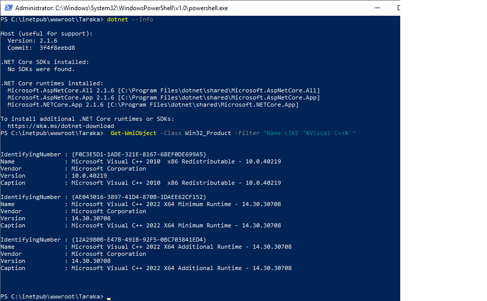

# dotnetcore-docker

#pull the image
docker pull mcr.microsoft.com/dotnet/framework/aspnet:4.8

#Create the docker from the image
docker run -t -i --name bms -d -p 80:80 mcr.microsoft.com/dotnet/framework/aspnet:4.8

#Download and install the the below tools

aspnetcore-runtime-2.1.6-win-x64
dotnet-hosting-2.1.6-win
VC_redist.x64
vcredist2010_x86

#instalation command

.\vcredist2010_x86.exe  /install /quiet /norestart /log logv

#check the installed version
dotnet --info
Get-WmiObject -Class Win32_Product -Filter "Name LIKE '%Visual C++%'"

IIS Mgmt installation

Install-WindowsFeature Web-Mgmt-Service

New-ItemProperty -Path HKLM:\software\microsoft\WebManagement\Server -Name EnableRemoteManagement -Value 1 -Force

Set-Service -Name wmsvc -StartupType automatic

net user iisadmin Password~1234 /ADD

net localgroup administrators iisadmin /add
