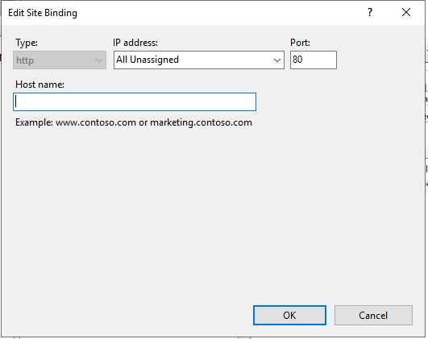

# dotnetcore-docker

#pull the image
docker pull mcr.microsoft.com/dotnet/framework/aspnet:4.8

#Create the docker from the image
docker run -t -i --name bms -d -p 80:80 mcr.microsoft.com/dotnet/framework/aspnet:4.8

#Download and install the the below tools

aspnetcore-runtime-2.1.6-win-x64
dotnet-hosting-2.1.6-win
VC_redist.x64
vcredist2010_x86

#instalation command

.\vcredist2010_x86.exe  /install /quiet /norestart /log logv

#check the installed version

dotnet --info

Get-WmiObject -Class Win32_Product -Filter "Name LIKE '%Visual C++%'"

**IIS Mgmt installation**

Install-WindowsFeature Web-Mgmt-Service

New-ItemProperty -Path HKLM:\software\microsoft\WebManagement\Server -Name EnableRemoteManagement -Value 1 -Force

Set-Service -Name wmsvc -StartupType automatic

net user iisadmin Password~1234 /ADD

net localgroup administrators iisadmin /add

install iis web management tool in local server and conect docker iis ip in host iis mgmt.

its asks ip and credentials.

Delete the default site

create new one named your site
create tow application pools
map web ui for main 
and api and api sync for application pools

#Your IIS Binding will be like

#MYSQL Instalation

Download binary
https://cdn.mysql.com/archives/mysql-8.0/mysql-8.0.27-winx64.zip

move files to c:\mysql
create c:\mysqldata
create my.ini file inside the mysql root folder

[mysqld]
# set basedir to your installation path
basedir="C:/MySQL_Home/"
# set datadir to the location of your data directory
datadir="C:/MySQL_Data_Directory/"

setx /M PATH "$($env:path);C:\mysql\bin\";

#restart the container
cd C:\mysql\bin>
C:\mysql\bin>mysqld.exe --initialize-insecure

other command prompt

start mysqld.exe

other cmd window 

mysql - u - root - p

ALTER USER 'root'@'localhost' IDENTIFIED BY 'krismds4';

FLUSH PRIVILEGES;

exit

#restart the container

cd C:\mysql\bin>

C:\mysql\bin>mysqld.exe --install

Set-Service -Name MySQL -StartupType Automatic

#login to mysql

mysql - u - root - p

CREATE USER 'tarakadev'@'localhost' IDENTIFIED BY 'taraka$Dev';

GRANT ALL PRIVILEGES ON * . * TO 'tarakadev'@'localhost';

FLUSH PRIVILEGES;
 
create database tarakaweb;

exit

#Restore Mysql DB
login to the conatiner in cmd

mysql -u root -p tarakaweb < tarakaweb.sql

